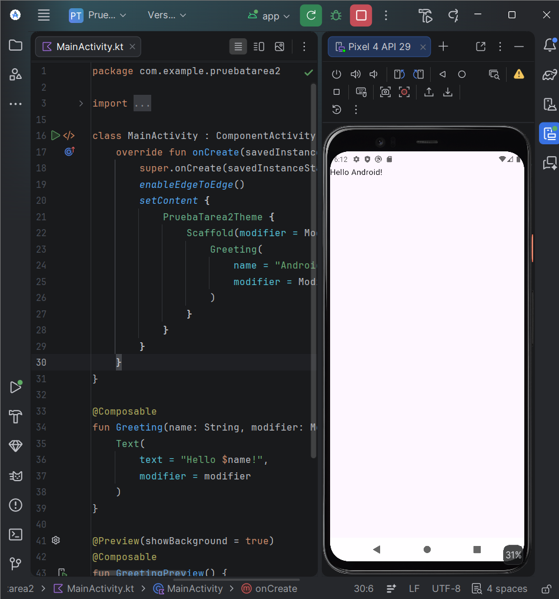
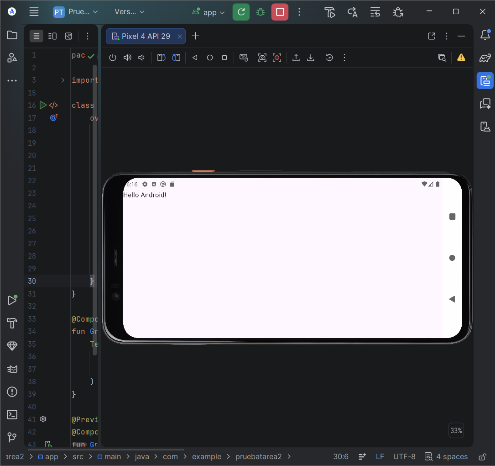
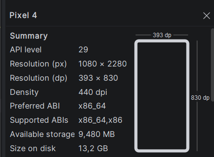
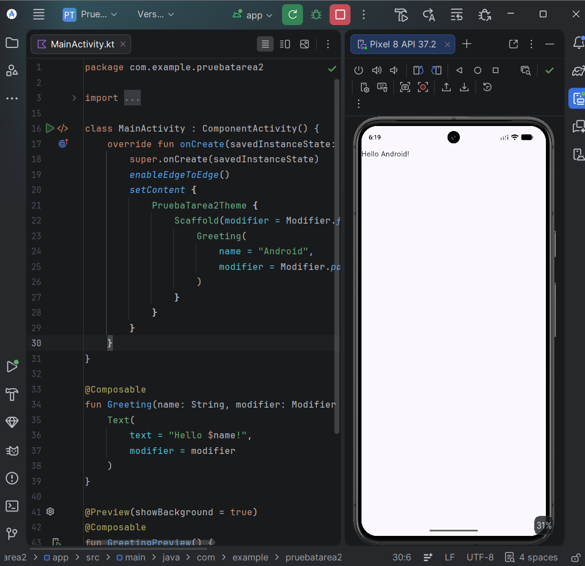
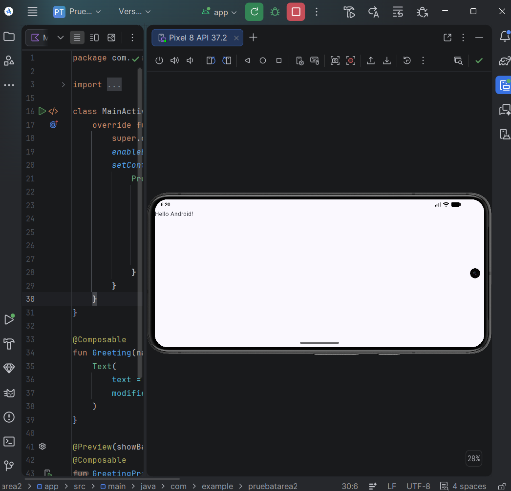
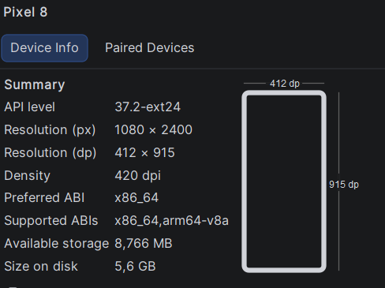
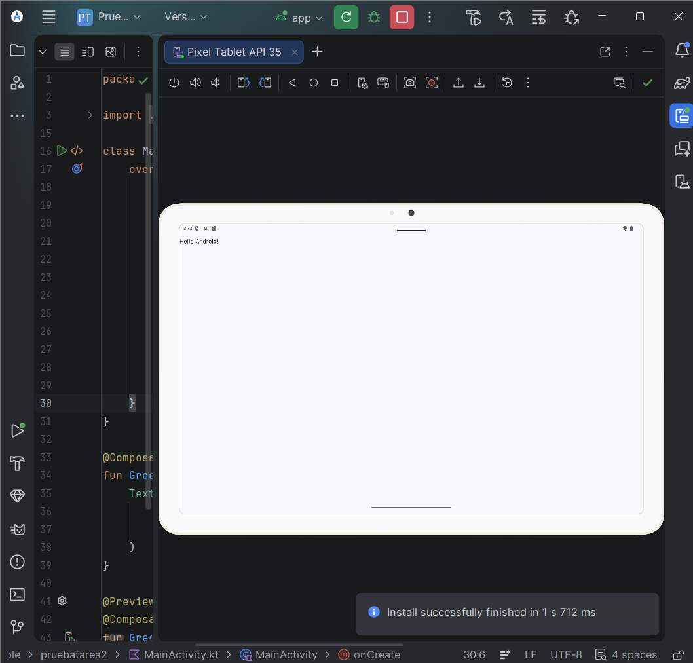
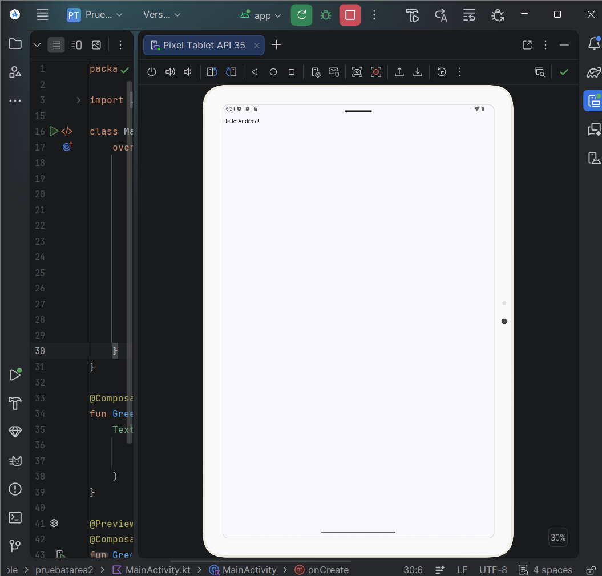
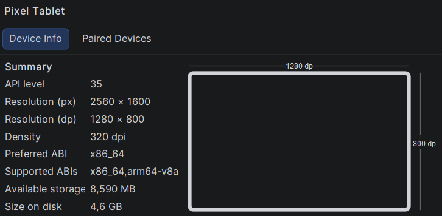

# A1.2 · Puesta en marcha del entorno

## 1. Fichas de configuración de los AVDs y capturas

### AVD 1: Pixel 4
* **Perfil:** Pixel 4
* **Nivel de API:** API 29 (Android 10)
* **Resolución (px):** 1080 x 2280 px
* **Resolución (dp):** 393 x 830 dp
* **Densidad:** 440 dpi (`xxhdpi`)

---

### AVD 2: Pixel 8
* **Perfil:** Pixel 8
* **Nivel de API:** API 35 (Android 15)
* **Resolución (px):** 1080 x 2400 px
* **Resolución (dp):** 412 x 915 dp
* **Densidad:** 420 dpi (`xxhdpi`)

---

### AVD 3: Pixel Tablet
* **Perfil:** Pixel Tablet
* **Nivel de API:** API 35 (Android 15)
* **Resolución (px):** 2560 x 1600 px
* **Resolución (dp):** 1280 x 800 dp
* **Densidad:** 320 dpi (`xhdpi`)

---

## 2. Diferencias observadas

Tras ejecutar la aplicación básica en los tres emuladores, apenas se aprecian diferencias visuales porque la app solo muestra el texto *"Hello Android!"*:

1. **Contenido App:** En todos los dispositivos el texto estáen la esquina superior izquierda.
2. **Espacio en blanco:** La mayor diferencia es la cantidad de pantalla sin usar. En los móviles el espacio en blanco queda más recogido, mientras que en la Tablet queda un espacio enorme vacío al ser una pantalla mucho más grande.
3. **Escalado texto:** El tamaño de la letra se mantiene legible y prácticamente idéntico entre dispositivos gracias a la escala por defecto del sistema, aunque no se aprovecha el formato de pantalla de cada dispositivo.