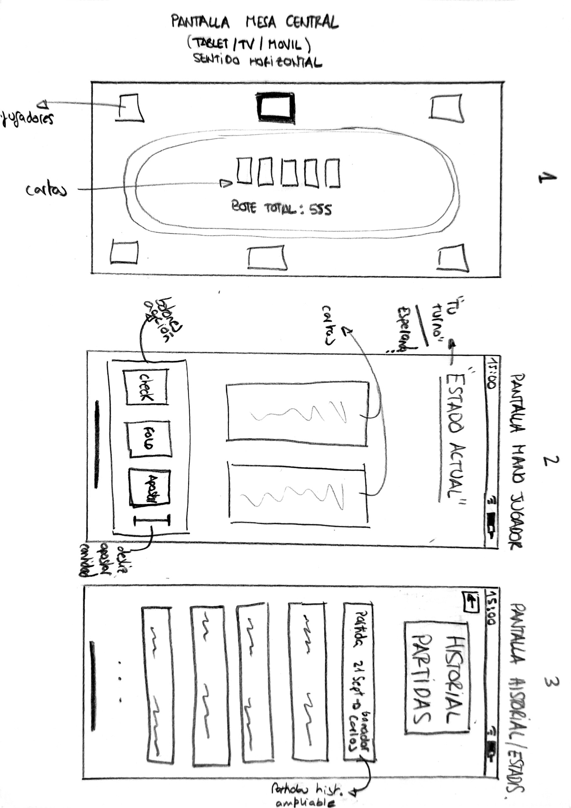

# Plantilla: propuesta del Proyecto A

## 0 · Datos

|||
|-|-|
|**Nombre de la app**|Pocket Poker|
|**Autor/a**|Alejandro Millán Polvorosa|
|**Fecha**|19/09/2026|

## 1 · La idea en una frase

> Qué hace tu app y para quién, en una sola frase.

Una app que permite jugar al póker sin baraja ni fichas físicas, en cualquier lugar y está dirigido a cualquier publico.

## 2 · El problema

> ¿Qué problema resuelve? 

Permite improvisar y jugar una partida de póker en cualquier lugar sin necesidad de llevar un maletín pesado de fichas ni una baraja de cartas, eliminando la incomodidad de repartir manualmente o calcular los botes sin errores.

> ¿Cómo se resuelve hoy sin tu app?

Llevando maletines de póker (pesados e incómodos de transportar), anotando fichas de cada jugador, o jugando en aplicaciones de póker online genéricas (incluidas casas de apuestas, evitándolas) donde cada jugador está aislado en su pantalla sin la experiencia de jugar en grupo cara a cara.

## 3 · Personas usuarias

> ¿Quién la va a usar? 

Alex, 21 años, estudiante de ciclo superior. Le gusta quedar los fines de semana con sus amigos en casa de alguno de ellos. Maneja el móvil con total soltura. Abriría la app al inicio de la partida y la mantendría activa en sesiones cortas e intensas de pocos segundos en cada turno de juego, pudiendo mantenerla en segundo plano. Una pantalla principal, de tipo table o Android tv (o similar) sería el centro de la mesa. Si la app falla puntualmente no sería un drama, ya que podría reconectarse a la partida, recuperando su progreso.

## 4 · Funcionalidades

### Imprescindibles (sin esto la app no tiene sentido)

|#|Funcionalidad|
|-|-|
|F1|Crear o unirse a una mesa local de póker asignando un stack inicial de fichas a cada jugador.|
|F2|Visualizar las cartas privadas de la mano en el teléfono móvil e interactuar enviando acciones a la mesa (Pasar, Apostar, Retirarse).|
|F3|Mostrar las cartas comunitarias y gestionar automáticamente las rondas de apuestas y el bote acumulado en la pantalla principal/mesa.|

### Opcionales (si sobra tiempo)

|#|Funcionalidad|
|-|-|
|O1|Guardar un historial de partidas locales con el balance de victorias y fichas de cada jugador.|
|O2|Personalizar el tapete visual de la mesa y el reverso de la baraja.|

## 5 · Pantallas

|Pantalla|Para qué sirve|Se llega desde|
|-|-|-|
|Inicio|Elegir modo de uso: crear mesa (pantalla central) o unirse como jugador.|(arranque)|
|Mesa Central (Tablet/TV)|Muestra el tapete de juego, las cartas comunitarias, el bote total y el turno activo.|Inicio|
|Mano del Jugador (Móvil)|Interfaz privada del jugador para ver sus 2 cartas ocultas, su stack de fichas y los botones de apuesta.|Inicio|
|  Historial / Estadísticas  |Consultar el registro de partidas pasadas y los balances de fichas acumulados.|Inicio|

## 6 · Bocetos

## 7 · Qué datos guarda la app

|Tipo de dato|Campos|Ejemplo|
|-|-|-|
|Jugador|ID, nombre, foto de perfil, fichas totales...|1, "Carlos", "carlos.jpg", 1500...|
|Partida|ID, fecha, bote final, id ganador...|102, "12/10/2026", 4500, 1...|
|Mano|ID, id partida, cartas mesa, bote actual...|55, 102, "As-Corazones, 10-Picas", 300...|

## 8 · Encaje con los requisitos del módulo

> Apartado obligatorio: ninguna casilla puede quedar vacía.

|Requisito|Dónde encaja en tu app|Tema|
|-|-|-|
|**Persistencia de datos** — la información sobrevive al cerrar la app|Guardado local de los datos del perfil de usuario, ajustes de partidas e historial de estadísticas...|4|
|**Servicio web** — la app consulta datos por internet|Sincronización en tiempo real del estado del juego (reparto de cartas, bote, turnos) entre dispositivos...|5|
|**Sensor o localización**|Acelerómetro/Giroscopio: Detectar el movimiento de agitar o poner el móvil boca abajo sobre la mesa para retirarse de la mano (Fold).  Cámara: Escanear un código QR en la mesa para unirse rápidamente.|6|
|**Contenido multimedia** — foto, audio, vídeo o animación|Reproducción de efectos de sonido (deslice de cartas, sonido de fichas al apostar), animaciones al ganar el bote, carga de foto de perfil tomada con la cámara, a parte de las imágenes de las cartas, tapete...|7|

## 9 · Riesgos

|Lo que me preocupa|Plan B|
|-|-|
|Dificultades en la conexión entre dispositivos en tiempo real.|Adaptarla a un simple modo de pasar y jugar en único dispositivo móvil, manteniendo el resto de lógica.|
|Aplicar de manera adecuada la lógica del póker(reparto y barajar, evaluar manos, reparto bote...)|Simplificar la reglas, o usar alguna librería externa.|

## Antes de entregar

* \[X] La idea cabe en una frase.
* \[X] El público es una persona concreta, no «todo el mundo».
* \[X] Hay **3 o 4** funcionalidades imprescindibles, no diez.54
* \[X] Cada funcionalidad imprescindible tiene su pantalla.
* \[X] Hay bocetos de las pantallas principales.
* \[X] **Las cuatro casillas del apartado 8 están rellenas.**
* \[X] Está identificado al menos un riesgo con su plan B.

